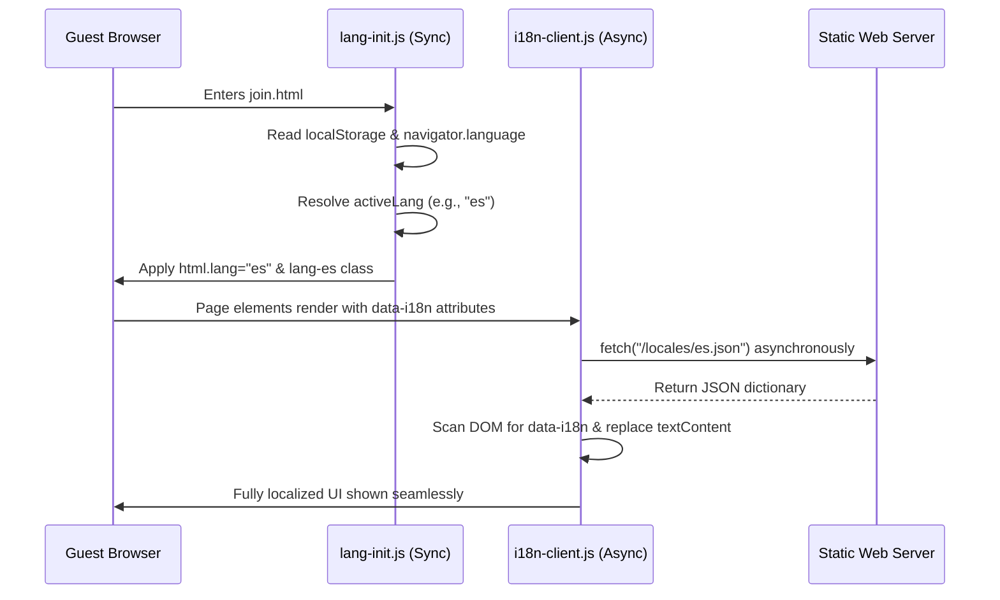

# KoalaSync Translation & Localization Guide

This guide describes how the localization system works for the KoalaSync website and provides step-by-step instructions on how a developer or an AI agent should add support for a new language.

---

## Architecture Overview

The KoalaSync website uses a custom, zero-dependency static site generator to compile localized pages from a single template:
- **Template Source**: `/website/template.html` (single source of truth).
- **Locales Source**: `/website/locales/[lang].json` (language dictionaries).
- **Build Pipeline**: `/website/build.js` (compiles pages into `/website/www/`).

---

## Supported Languages

> [!NOTE]
> **Contributor Guideline: Translation Quality Distinction**
> To maintain the highest standard of UX and accessibility, KoalaSync categorizes languages into two tiers. Core languages (`en` and `de`) are manually translated and verified by native speakers. Extended languages (`fr` and `es`) are currently machine-translated to broaden accessibility, and need native review. Future contributors are encouraged to audit "Auto-Generated" translations and submit PRs to elevate them to "Verified" status.

The following table provides an overview of all currently active languages on the KoalaSync platform:

| Language Code | Language Name | Status |
| :--- | :--- | :--- |
| `en` | English | 100% Manually Verified |
| `de` | German | 100% Manually Verified |
| `fr` | French | Auto-Generated (May contain errors / Needs Native Speaker Review) |
| `es` | Spanish | Auto-Generated (May contain errors / Needs Native Speaker Review) |
| `pt-BR` | Portuguese (Brasil) | Auto-Generated (May contain errors / Needs Native Speaker Review) |
| `ru` | Russian | Auto-Generated (May contain errors / Needs Native Speaker Review) |

> [!WARNING]
> **Autogeneration Rule**
> Any future languages added to the static site generator (e.g., Italian, Dutch) MUST be marked as `"Auto-Generated (May contain errors / Needs Native Speaker Review)"` in this table until a native speaker manually reviews and signs off on the translations.

---

## Strict Legal Exclusion Rule

> [!IMPORTANT]
> **DO NOT TRANSLATE LEGAL PAGES**
> The imprint and privacy pages ([impressum.html](file:///Users/koala/Documents/KoalaPlay/website/impressum.html) and [datenschutz.html](file:///Users/koala/Documents/KoalaPlay/website/datenschutz.html)) **MUST NOT** be translated into any other languages.
> They are strictly restricted to **English** and **German** only.
>
> **Rationale:** Legal compliance and liability under European Union (GDPR) and German (DDG) laws. Offering legal notices in auto-generated languages introduces risks of mistranslations that could be legally binding or misrepresent liabilities.
>
> **Technical Fallback:** `lang-init.js` is configured to automatically fall back to **English** for these pages if the user's active preference is French, Spanish, or any other unsupported language, ensuring they see legally verified text while preserving their language state when returning home.

---

## Step-by-Step: Adding a New Language

Follow this exact workflow to add a new language (for example, Italian - `it`):

### Step 1: Create the Translation Dictionary
Create a new JSON file inside `/website/locales/` named `[lang].json` (e.g., `/website/locales/it.json`).
- Copy `/website/locales/en.json` to act as your baseline template.
- Translate all key values while preserving key names.
- Update the system configuration keys at the top of the file:
  ```json
  {
    "LANG_CODE": "it",
    "HTML_CLASS": "lang-it",
    "CANONICAL_PATH": "it/",
    "LANG_TOGGLE_URL": "../",
    "LANG_TOGGLE_TEXT": "EN",
    ...
  }
  ```

### Step 2: Register the Language in the Build Script
Open `/website/build.js` and simply append the new language code to the `languages` array:
```javascript
const languages = ['en', 'de', 'fr', 'es', 'pt-BR', 'ru', 'it'];
```
The dynamic compiler loop will automatically load your JSON dictionary, create `/website/www/it/`, and compile `/website/www/it/index.html` with correct sitemaps, canoncials, and relative assets.

### Step 3: Run Compilation
Run the build script from the repository root:
```bash
node website/build.js
```
Verify the output is generated inside `/website/www/[lang]/index.html`.

### Step 4: Update this Guide
Add the new language entry to the **Supported Languages** table above with the appropriate status marking.

---

## Future Architecture: Dynamic Utility Pages

For dynamic utility pages like `join.html`, we need to support unlimited languages in the future under a strict architectural constraint: **the share link URL must never contain language path details or query parameters.**

### Proposed Client-Side i18n Architecture

To achieve this without bloating the HTML DOM with duplicate text nodes for every language (which leads to `display: none` sprawl), we propose an **asynchronous JSON dictionary injection architecture**:



#### 1. Markup Definition (Semantic Tags)
The HTML file `join.html` will contain only generic, language-independent tags with data attributes for translation keys. English text is placed as a native placeholder fallback:
```html
<h1 data-i18n="JOIN_TITLE">Ready to sync?</h1>
<p id="join-desc" data-i18n="JOIN_SUBTITLE">You've been invited to join a session.</p>
```

#### 2. Client-Side i18n Engine (`i18n-client.js`)
We will create a lightweight client-side translation engine that executes asynchronously on page load:
```javascript
document.addEventListener('DOMContentLoaded', async () => {
    // 1. Recover localized preference determined by lang-init.js
    const activeLang = document.documentElement.lang || 'en';
    
    // 2. Fetch the corresponding locale JSON file asynchronously
    try {
        const response = await fetch(`locales/${activeLang}.json`);
        if (!response.ok) throw new Error('Locale not found');
        const dictionary = await response.json();
        
        // 3. Update DOM elements carrying data-i18n attribute
        document.querySelectorAll('[data-i18n]').forEach(el => {
            const key = el.getAttribute('data-i18n');
            if (dictionary[key]) {
                // If it is an image, update alt text instead
                if (el.tagName === 'IMG') {
                    el.alt = dictionary[key];
                } else {
                    el.textContent = dictionary[key];
                }
            }
        });
    } catch (err) {
        console.warn('i18n dynamic load failed, falling back to English defaults:', err);
    }
});
```

#### Advantages of this Approach
1. **Zero URL Contamination**: The share link remains clean (e.g., `/join.html#join:room:pass`), ensuring absolute anonymity and avoiding hardcoding the sender's language onto the receiver.
2. **Minimal DOM Footprint**: Eliminates duplicate `<span lang="de">`, `<span lang="en">` blocks entirely, reducing page size by 50% and eliminating slow style recalculations.
3. **Infinite Scale**: Support for new languages (e.g., Italian, Japanese) requires zero modifications to `join.html`. The client simply downloads the appropriate locale JSON file asynchronously on demand.

